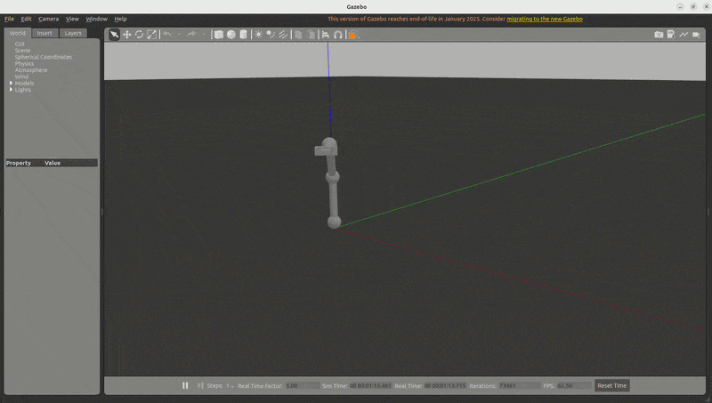

# gesture-arm

A 3-axis robot arm (base rotation plus two bending joints) simulated in ROS 2 and Gazebo, driven through `ros2_control` with a joint trajectory controller.

> **Status:** the arm simulation and a demo command node work. Gesture control (hand tracking with MediaPipe) is planned and not implemented yet.



## What it does

- Models the arm in URDF/xacro and spawns it in Gazebo
- Controls the joints with `ros2_control` using a joint trajectory controller
- Includes a demo node that publishes trajectory commands, so the arm repeats a movement sequence on its own

## Packages

| Package | Contents |
|---|---|
| `arm_description` | Arm model (`urdf/arm.urdf.xacro`), controller config (`config/arm_controllers.yaml`), Gazebo launch file (`launch/gazebo.launch.py`) |
| `arm_control` | `demo` node, which sends the movement commands |

## Requirements

- Ubuntu 22.04
- ROS 2 Humble
- Gazebo with the ROS 2 integration, plus `ros2_control` and `joint_trajectory_controller`

## Build

```bash
cd ~/ros2_ws/src
git clone https://github.com/Aditya3003/gesture-arm.git
cd ~/ros2_ws
colcon build
source install/setup.bash
```

## Run

Terminal 1: start Gazebo with the arm and controllers

```bash
ros2 launch arm_description gazebo.launch.py
```

Terminal 2: start the demo movement

```bash
ros2 run arm_control demo
```

## Roadmap

- [ ] Gesture control: track a hand with MediaPipe and map it to arm joint commands
- [ ] Closed-loop control (for example PID) on top of the trajectory controller

## Author

Aditya Kambhampati, MSc Mechatronics and Cyber-Physical Systems, TH Deggendorf
